## Front-end

La liste des produits :

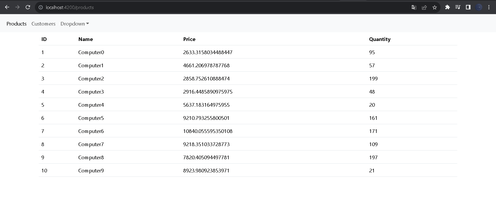

 

La liste des clients :

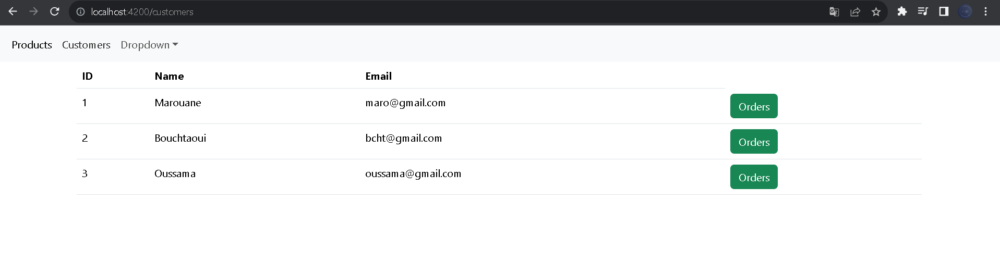

Chaque client a une liste des ordres (green button):

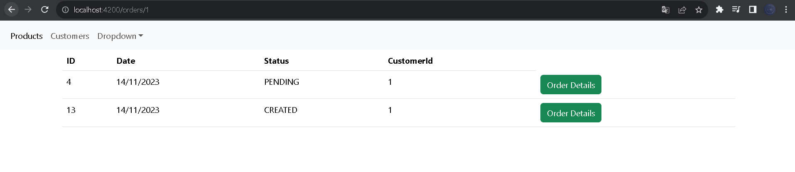

Les details de chaque ordre:

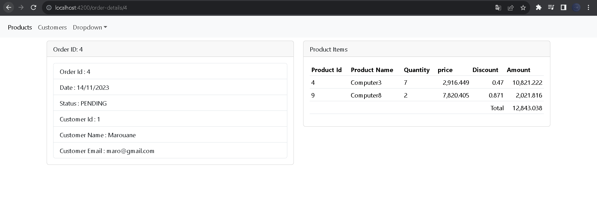

 

La configuration du CORS(gateway-serice):

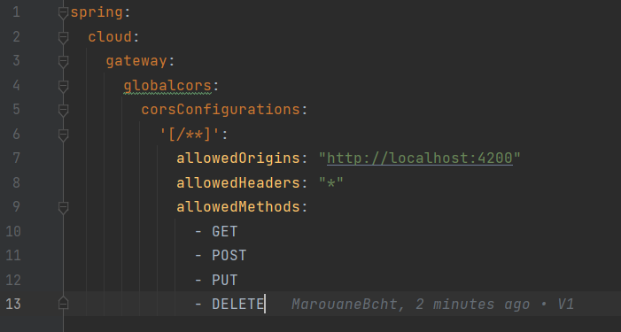

 

## Back-end

Les services dans Consul:

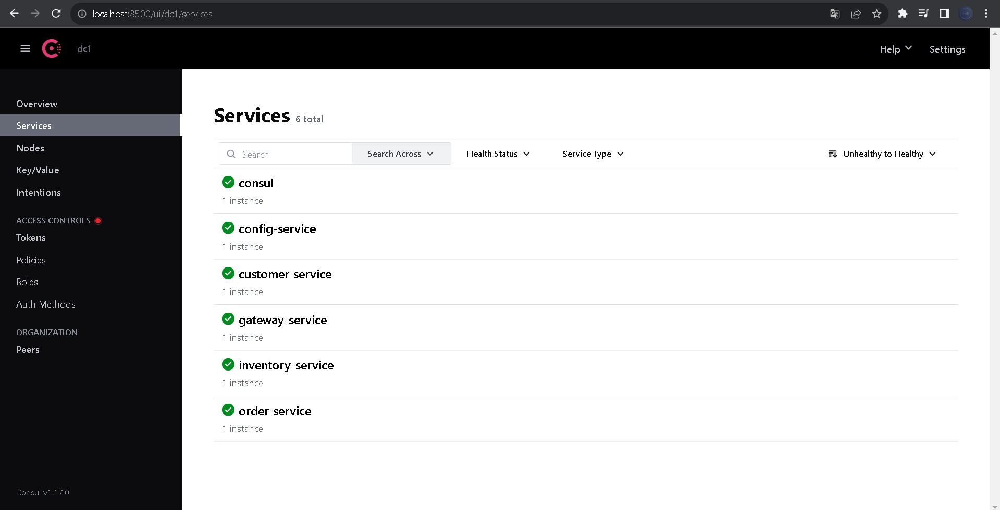

L'interface Concul où on a enregistré la configuration :
 

On teste avec une class RestController si la config consul fonctionne:

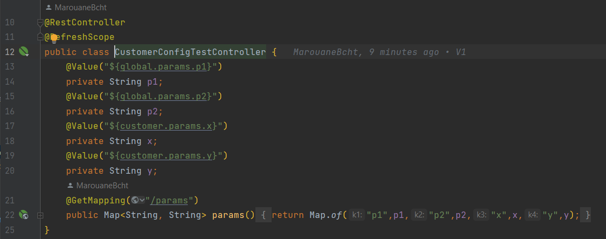

 

### Vault Config

L'interface Vault où on a enregistré la configuration :

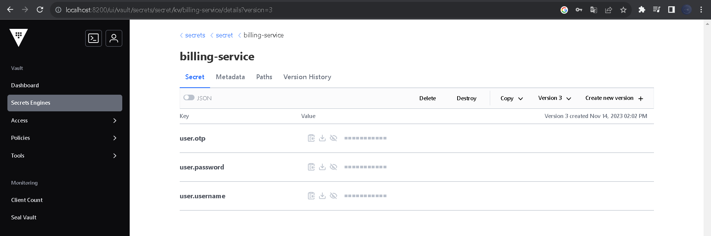

La configuration dans les microservices:

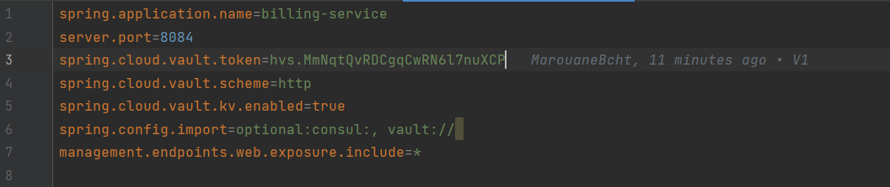

On teste avec une class RestController si la config est bien importée:

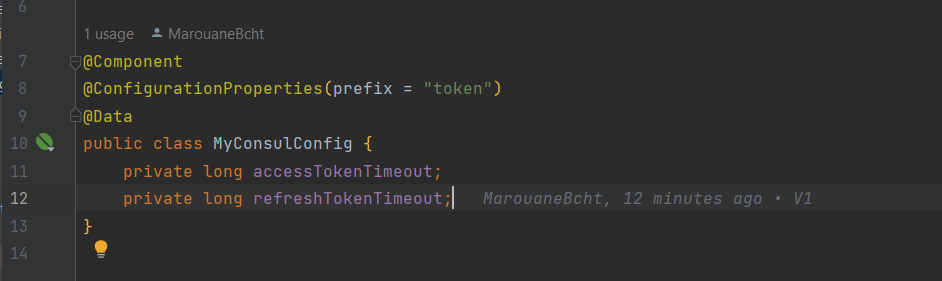
 

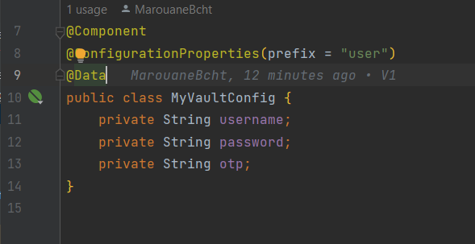

 

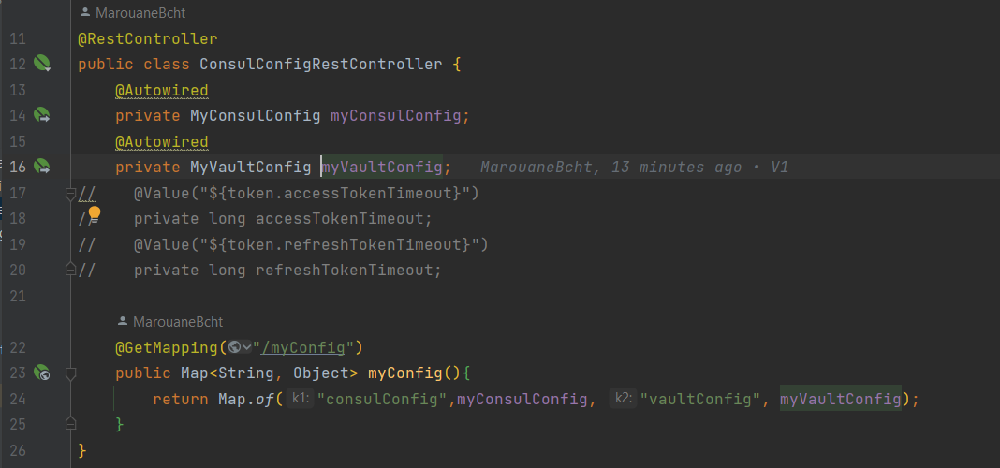

 
